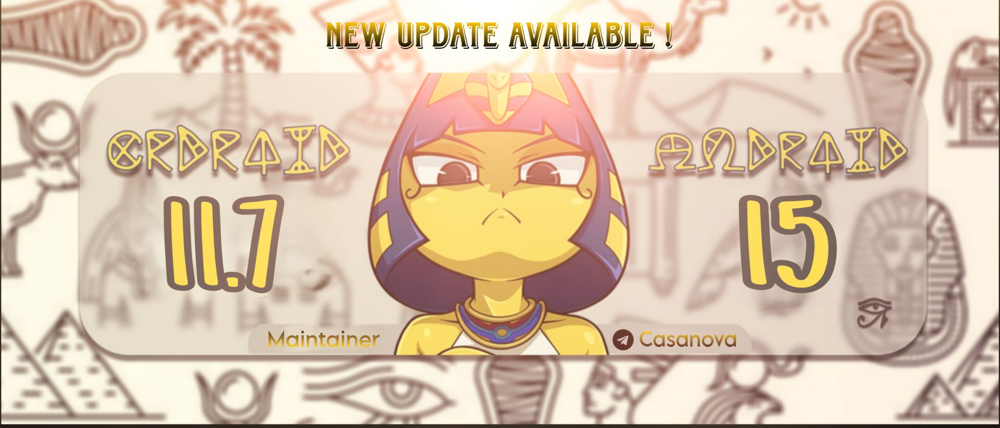

  

# crDroid 11.7 for Redmi Note 12 Pro/Pro+ 5G (rubyx)

---

## 📱 About

Unofficial **crDroid v11.7** build for **Redmi Note 12 Pro/Pro+ 5G (rubyx)**  
Built on **Android 15 QPR2**.  

---

## 📥 Downloads

- [ROM Download](https://drive.google.com/file/d/1e8xwXPD7_7hHF1hphBAyF5pUNfU9wxYp/view?usp=drive_link)
- [boot.img](https://drive.google.com/file/d/1hkMdSml9hzvZFfmIBvNplspWBRr3zVs6/view?usp=drivesdk)
- [GApps](https://sourceforge.net/projects/nikgapps/files/Elite-Releases/crdroid-official/Android-15/16-Jul-2025/NikGapps-crdroid-official-arm64-15-20250716-signed.zip/download) 

---

## ⚡ Features & Notes

- MIUI Camera **included**  
- Supports **dirty flash**  
- **Firmware included**  
- Must use the **provided boot.img** 

---

## 📖 Flashing Guide

See the full [Flashing Guide](./FLASHING_GUIDE.md).
---

## 🔄 Changelog

- Check [here](https://crdroid.net/blog/2025-07-19-crDroid-12-is-cooking-whille-crDroid-11.7-is-ready) 

---

## 🛠 Known Issues

- None major reported yet.  
- Report bugs via Telegram group with detailed logs or enjoy them as features.

---

## 🙏 Credits

- **Bengis32** and **rubyx-devs** → device/vendor/kernel trees  
- **Aeron** & **Rares** → guidance  
- **Raza** → testing  

---

## 👤 Maintainer

Maintained by **Rajdeep [@WasOnceCasanova](https://t.me/WasOnceCasanova)**  
Follow updates: [@RedmiNote12ProPlusUpdates](https://t.me/RedmiNote12ProPlusUpdates)  
Community: [@RedmiNote12ProPlusCommunity](https://t.me/RedmiNote12ProPlusCommunity)
